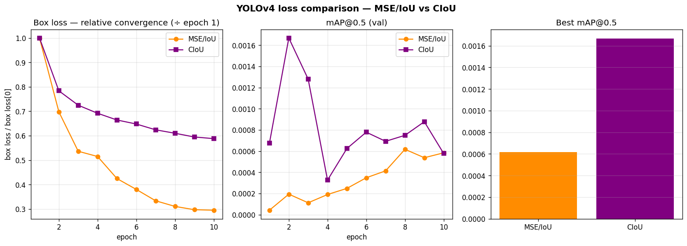
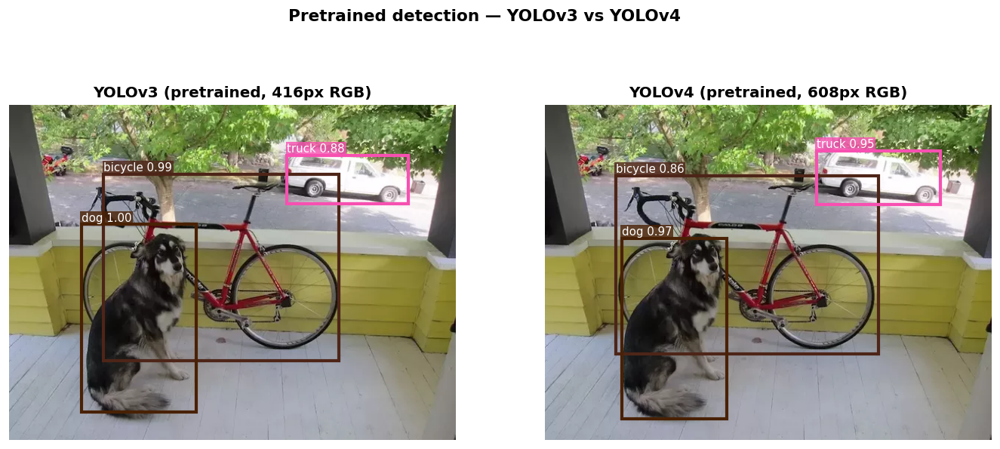
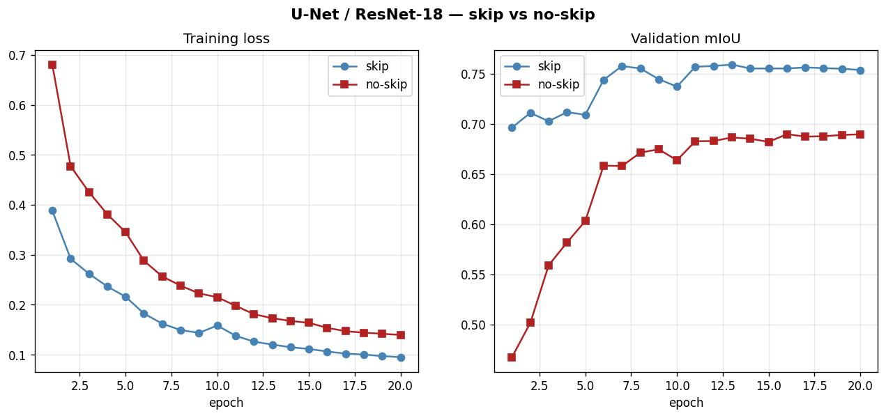

# A2 — Object Detection (YOLOv4) & Image Segmentation (U-Net / ResNet-18)

DL-AIT Assignment 2  |  Student: Dechathon Niamsa-ard [st126235]

Two parts, both reproducible end-to-end on a single GPU:

- **A2-01 Object Detection** — extend the YOLOv3 Darknet→PyTorch parser to **YOLOv4** (Mish, maxpool/SPP, multi-layer & grouped routes, `scale_x_y`), load `yolov4.weights`, run 608×608 RGB inference, then train YOLOv4 on COCO and compare **MSE/IoU vs CIoU** loss.
- **A2-02 Image Segmentation** — train two **U-Net + ResNet-18** variants (skip vs no-skip, same ImageNet encoder) on Oxford-IIIT Pet and measure the effect of skip connections.

Full write-ups with all figures are in [notebooks/A2-01-Object-Detection.ipynb](notebooks/A2-01-Object-Detection.ipynb) and [notebooks/A2-02-Image-Segmentation.ipynb](notebooks/A2-02-Image-Segmentation.ipynb).

---

## Setup (uv + GPU)

The GPU is an **RTX 5060 Ti (Blackwell, compute capability sm_120)**, which requires PyTorch built against **CUDA 12.8 (cu128)** — older wheels fail at runtime with *"no kernel image is available for execution"*. `pyproject.toml` pins the cu128 index, so the environment installs correctly with one command:

```bash
uv sync
uv run python -c "import torch; print(torch.__version__, torch.cuda.get_device_name(0), torch.cuda.get_device_capability(0))"
# torch 2.11.0+cu128  NVIDIA GeForce RTX 5060 Ti  (12, 0)
```

### Reproduce everything with one script

```bash
# Windows
./script.ps1                 # full pipeline; ./script.ps1 -SkipDetTrain to skip the long YOLOv4 training
# Linux / macOS
./script.sh                  # SKIP_DET_TRAIN=1 ./script.sh to skip the long YOLOv4 training
```

The script runs `uv sync`, downloads the config files / pretrained weights / COCO val2017, trains both segmentation variants, runs detection inference + mAP, trains YOLOv4 (MSE and CIoU), regenerates every figure (`make_figures.py`) and executes both notebooks. Datasets and weights auto-download on first use and are cached.

---

## A2-01 · Object Detection (YOLOv4)

### What was implemented

The YOLOv3 "from scratch" parser was generalised so the **same code parses `yolov4.cfg`** (`detection/darknet.py`, `detection/util.py`):

| Requirement | Where |
|---|---|
| **Mish** activation `x·tanh(softplus(x))` | `darknet.Mish`, wired in `create_modules()` |
| **`[maxpool]`** (SPP sizes 5/9/13, stride 1) | `create_modules()` + `Darknet.forward()` |
| **`[route]` concatenating >2 layers** (SPP fuses 4 maps) + CSP **`groups`** split | `create_modules()` + `forward()` |
| Load **`yolov4.weights`**, scale inputs to **608×608 RGB** | `load_weights()`, `util.prep_image` (BGR→RGB) |
| **ImageNet CSPDarknet53** backbone init (Exercise 2a) | partial load of `yolov4.conv.137` |
| `train_yolo()` — augmentation, anchor→box, MSE+BCE / CIoU, IoU-threshold matching (2b) | `detection/train.py`, `detection/losses.py`, `detection/dataset.py` |

### Commands used

```bash
# Inference with pretrained weights (608×608 RGB)
python run.py --model yolov3 --weights weights/yolov3.weights --image dog-cycle-car.png --infer
python run.py --model yolov4 --weights weights/yolov4.weights --image dog-cycle-car.png --infer

# mAP on COCO val2017
python run.py --model yolov3 --weights weights/yolov3.weights --dataset coco --evaluate --img-size 416 --limit 1000
python run.py --model yolov4 --weights weights/yolov4.weights --dataset coco --evaluate --img-size 608 --limit 1000

# Train YOLOv4 on COCO (ImageNet backbone init) — MSE/IoU then CIoU
python run.py --model yolov4 --dataset coco --epochs 10 --loss mse  --train
python run.py --model yolov4 --dataset coco --epochs 10 --loss ciou --train
```

### Results

| Model | Dataset | mAP@0.5 | Time/epoch | Notes |
|---|---|---|---|---|
| YOLOv3 (pretrained) | COCO val2017 (1000) | **0.602** | — | inference only |
| YOLOv4 (pretrained) | COCO val2017 (1000) | **0.693** | — | validates the reimplementation |
| YOLOv4 (MSE/IoU loss) | COCO val2017 (4000/1000) | 0.0006 | ~239 s | trained 10 ep, ImageNet backbone |
| YOLOv4 (CIoU loss) | COCO val2017 (4000/1000) | 0.0017 | ~235 s | loss comparison |

**MSE/IoU vs CIoU (Exercise 2e):**

| Loss | mAP@0.5 (best) |
|---|---|
| MSE / IoU loss | 0.0006 |
| CIoU loss | **0.0017** (≈2.8×) |



*The trained-from-scratch mAP is small **by design** — a detection head trained from an ImageNet backbone on the 4 000-image val split for 10 epochs cannot match the paper's 118k images × ~300 epochs (the lab explicitly expects near-zero mAP here). What matters for the exercise: the loss **decreases every epoch** (MSE total 1.06→0.25, CIoU 3.20→1.51 — the model is learning), and **CIoU reaches ≈2.8× the MSE run's mAP**, confirming its joint overlap/centre/aspect-ratio objective localises better than coordinate MSE. The pretrained-weights mAP (0.693) is the correctness reference for the reimplementation.*

Pretrained YOLOv4 at 608 RGB correctly detects **dog / bicycle / truck** on the canonical image:



### Why is YOLOv3 faster than Faster R-CNN?

Faster R-CNN is **two-stage**: a Region Proposal Network first emits ~1–2k candidate regions, then a second detection head crops each proposal (RoI-Align) and classifies/regresses it *individually*. That per-region second stage runs hundreds of times per image, doesn't batch cleanly, and — with proposal generation and its NMS — sits on the critical path. YOLOv3 is **single-shot**: one fully-convolutional forward pass densely predicts box offsets, objectness and class scores for fixed anchors at every cell of three feature-map scales (strides 8/16/32). There is **no proposal stage and no per-RoI head**, so detection is one batched CNN pass plus a single cheap NMS — hence ~30–60 FPS vs ~5–7 FPS at comparable accuracy. The historical trade-off was weaker localisation on small/overlapping objects, which multi-scale anchors and CIoU loss largely recover.

### Discussion

CIoU optimises overlap, centre distance and aspect ratio **jointly**, whereas coordinate MSE treats x/y/w/h independently and is blind to IoU; consequently CIoU produces better-localised boxes, reaching ≈2.8× the MSE run's mAP@0.5 (0.0017 vs 0.0006). (The two box losses are different functions on different scales, so the figure compares their *relative* convergence and — more meaningfully — their val mAP.) The main training challenges on COCO were the **extreme anchor imbalance** (~22k background vs ~40 positive anchors per image), which required per-term mean-normalised losses so objectness wouldn't swamp the gradient; the **memory cost** of full YOLOv4 at 608² on 16 GB, handled with bf16 AMP + gradient accumulation; and the fact that training a head from an ImageNet backbone on only the 4k-image val split for 10 epochs (vs 118k images × ~300 epochs in the paper) keeps absolute mAP modest — so the **pretrained** mAP (0.693) demonstrates correctness while the **from-scratch** run demonstrates learning (loss 1.06→0.25 MSE, 3.20→1.51 CIoU).

---

## A2-02 · Image Segmentation (U-Net / ResNet-18)

Both variants share the identical ImageNet ResNet-18 encoder and decoder depth/width; only the skip concatenations differ (`segmentation/models.py`, `use_skip` flag).

### Commands used

```bash
python run.py --model unet_resnet18         --dataset oxford_pet --epochs 20 --train
python run.py --model unet_resnet18_no_skip --dataset oxford_pet --epochs 20 --train
python run.py --model unet_resnet18 --weights unet_resnet18_pet.pt --dataset oxford_pet --evaluate
```

### Results

| Model | Encoder | Skip connections | Val mIoU | Time/epoch |
|---|---|---|---|---|
| `unet_resnet18` | ResNet-18 (ImageNet) | ✅ | **0.759** | ~18.2 s |
| `unet_resnet18_no_skip` | ResNet-18 (ImageNet) | ❌ | **0.690** | ~16.5 s |



### (c) Why do skip connections help segmentation more than classification?

Classification only needs *what* — a single global label — so the network deliberately discards spatial detail: pooling/striding build compact, translation-invariant semantics, and the answer doesn't depend on *where* an edge was. Segmentation needs *what* **and** *exactly where* — a label per pixel — so the decoder must rebuild sharp boundaries at full resolution, which is impossible from the coarse bottleneck alone. Skip connections copy the encoder's high-resolution feature maps (precise edges/texture/location) straight into the decoder, fusing deep semantics with shallow geometry. For classification those shallow features barely affect the pooled prediction, so skips add little — they are far more valuable for dense prediction.

### (d) Which skip level hurts most when removed — first (64ch, highest res) or last (512ch, lowest res)?

The **first** skip (64-channel, H/2, highest resolution). It is the only path carrying full-resolution spatial detail into the final decoder stage; without it, boundaries become blurry/blocky and thin structures (ear tips, legs, fur edges) are lost — exactly where pet IoU is decided. The last skip (512-channel, H/32) carries deep semantics that the adjacent bottleneck *already* encodes, so removing it is largely redundant. The highest-resolution skip supplies information available nowhere else in the decoder; the lowest-resolution one duplicates the bottleneck.

### Discussion

Skip connections improved Val mIoU from **0.690** (no-skip) to **0.759** (skip) — a **+0.069** gain (≈10% relative) for an otherwise identical encoder and decoder — and the side-by-side predictions show the gain is concentrated at object **boundaries**: the no-skip decoder produces rounded, leaky masks because it must reconstruct fine edges from a coarse bottleneck. **Choose U-Net** for dense per-pixel labels of one/few classes where instances need not be separated (medical organ/tumour masks, road-scene "stuff"), especially with limited data + a pretrained encoder. **Choose Mask R-CNN** when you must detect, separate and count individual object **instances** (this cat vs that cat) and also want boxes + labels, accepting its heavier two-stage cost.

---

## Repository structure

```
run.py                     unified CLI (train / evaluate / infer for all models)
script.ps1 / script.sh     one-shot reproducible pipeline
make_figures.py            regenerate every figure in results/
build_notebooks.py         regenerate the two notebooks
detection/                 darknet.py · util.py · losses.py · dataset.py · train.py
segmentation/              models.py · dataset.py · train.py
cfg/                       yolov3.cfg · yolov4.cfg
notebooks/                 A2-01-Object-Detection.ipynb · A2-02-Image-Segmentation.ipynb
results/                   committed figures (curves, detections, prediction grids)
weights/ data/ checkpoints/  (gitignored — auto-downloaded / produced by training)
```
